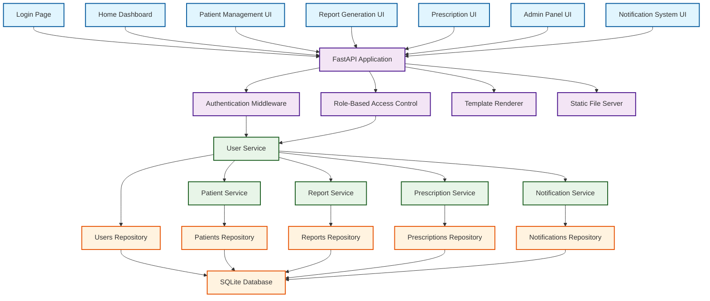

```mermaid
graph TD
    %% Frontend Components
    FE1[Login Page]
    FE2[Home Dashboard]
    FE3[Patient Management UI]
    FE4[Report Generation UI]
    FE5[Prescription UI]
    FE6[Admin Panel UI]
    FE7[Notification System UI]

    %% Backend Components
    BE1[FastAPI Application]
    BE2[Authentication Middleware]
    BE3[Role-Based Access Control]
    BE4[Template Renderer]
    BE5[Static File Server]

    %% Service Components
    S1[User Service]
    S2[Patient Service]
    S3[Report Service]
    S4[Prescription Service]
    S5[Notification Service]

    %% Data Components
    D1[SQLite Database]
    D2[Users Repository]
    D3[Patients Repository]
    D4[Reports Repository]
    D5[Prescriptions Repository]
    D6[Notifications Repository]

    %% Relationships
    FE1 --> BE1
    FE2 --> BE1
    FE3 --> BE1
    FE4 --> BE1
    FE5 --> BE1
    FE6 --> BE1
    FE7 --> BE1

    BE1 --> BE2
    BE1 --> BE3
    BE1 --> BE4
    BE1 --> BE5

    BE2 --> S1
    BE3 --> S1

    S1 --> D2
    S2 --> D3
    S3 --> D4
    S4 --> D5
    S5 --> D6

    D2 --> D1
    D3 --> D1
    D4 --> D1
    D5 --> D1
    D6 --> D1

    S1 --> S2
    S1 --> S3
    S1 --> S4
    S1 --> S5

    %% Styling
    classDef frontend fill:#e1f5fe,stroke:#01579b,stroke-width:2px
    classDef backend fill:#f3e5f5,stroke:#4a148c,stroke-width:2px
    classDef service fill:#e8f5e8,stroke:#1b5e20,stroke-width:2px
    classDef data fill:#fff3e0,stroke:#e65100,stroke-width:2px

    class FE1,FE2,FE3,FE4,FE5,FE6,FE7 frontend
    class BE1,BE2,BE3,BE4,BE5 backend
    class S1,S2,S3,S4,S5 service
    class D1,D2,D3,D4,D5,D6 data
```