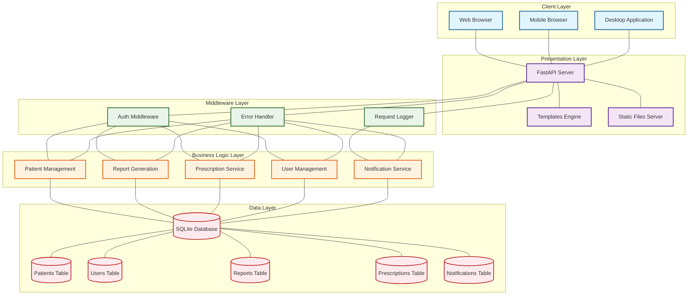

```mermaid
graph TD
    subgraph "Client Layer"
        B1[Web Browser]
        B2[Mobile Browser]
        B3[Desktop Application]
    end

    subgraph "Presentation Layer"
        F1[FastAPI Server]
        T1[Templates Engine]
        S1[Static Files Server]
    end

    subgraph "Middleware Layer"
        M1[Auth Middleware]
        M2[Request Logger]
        M3[Error Handler]
    end

    subgraph "Business Logic Layer"
        C1[Patient Management]
        C2[Report Generation]
        C3[Prescription Service]
        C4[User Management]
        C5[Notification Service]
    end

    subgraph "Data Layer"
        D1[(SQLite Database)]
        D1 --- P1[(Patients Table)]
        D1 --- U1[(Users Table)]
        D1 --- R1[(Reports Table)]
        D1 --- PR1[(Prescriptions Table)]
        D1 --- N1[(Notifications Table)]
    end

    %% Connections
    B1 --- F1
    B2 --- F1
    B3 --- F1
    
    F1 --- T1
    F1 --- S1
    F1 --- M1
    F1 --- M2
    F1 --- M3
    
    M1 --- C1
    M1 --- C2
    M1 --- C3
    M1 --- C4
    M2 --- C5
    M3 --- C1
    M3 --- C2
    M3 --- C3
    M3 --- C4
    M3 --- C5
    
    C1 --- D1
    C2 --- D1
    C3 --- D1
    C4 --- D1
    C5 --- D1
    
    %% Styling
    classDef clientLayer fill:#e1f5fe,stroke:#01579b,stroke-width:2px
    classDef presentationLayer fill:#f3e5f5,stroke:#4a148c,stroke-width:2px
    classDef middlewareLayer fill:#e8f5e8,stroke:#1b5e20,stroke-width:2px
    classDef businessLayer fill:#fff3e0,stroke:#e65100,stroke-width:2px
    classDef dataLayer fill:#ffebee,stroke:#b71c1c,stroke-width:2px
    
    class B1,B2,B3 clientLayer
    class F1,T1,S1 presentationLayer
    class M1,M2,M3 middlewareLayer
    class C1,C2,C3,C4,C5 businessLayer
    class D1,P1,U1,R1,PR1,N1 dataLayer
```