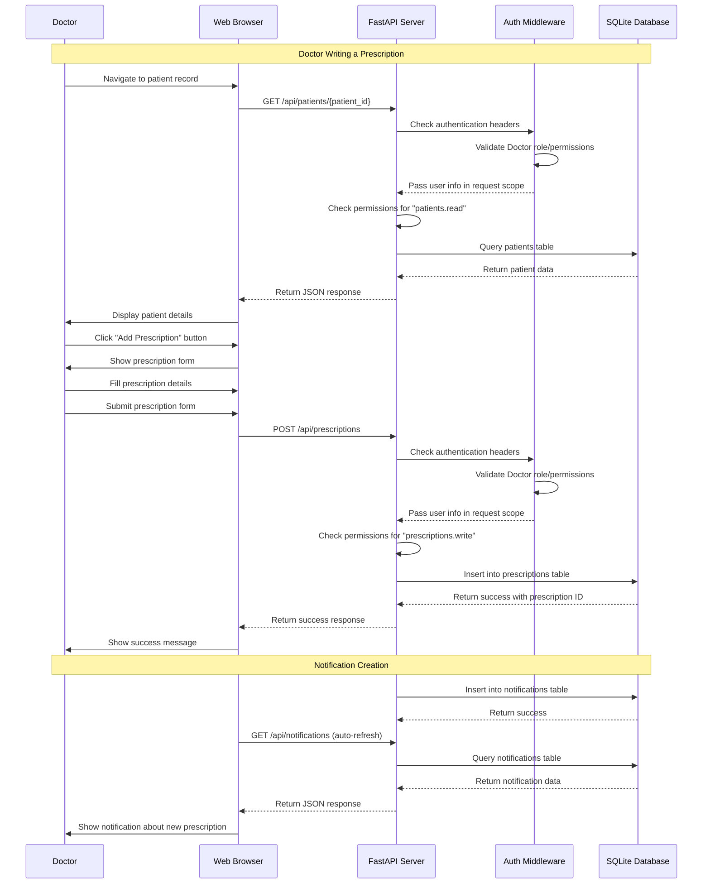

```mermaid
sequenceDiagram
    participant D as Doctor
    participant W as Web Browser
    participant F as FastAPI Server
    participant M as Auth Middleware
    participant DB as SQLite Database

    Note over D,DB: Doctor Writing a Prescription
    D->>W: Navigate to patient record
    W->>F: GET /api/patients/{patient_id}
    F->>M: Check authentication headers
    M->>M: Validate Doctor role/permissions
    M-->>F: Pass user info in request scope
    F->>F: Check permissions for "patients.read"
    F->>DB: Query patients table
    DB-->>F: Return patient data
    F-->>W: Return JSON response
    W->>D: Display patient details

    D->>W: Click "Add Prescription" button
    W->>D: Show prescription form

    D->>W: Fill prescription details
    D->>W: Submit prescription form
    W->>F: POST /api/prescriptions
    F->>M: Check authentication headers
    M->>M: Validate Doctor role/permissions
    M-->>F: Pass user info in request scope
    F->>F: Check permissions for "prescriptions.write"
    F->>DB: Insert into prescriptions table
    DB-->>F: Return success with prescription ID
    F-->>W: Return success response
    W->>D: Show success message

    Note over D,DB: Notification Creation
    F->>DB: Insert into notifications table
    DB-->>F: Return success
    W->>F: GET /api/notifications (auto-refresh)
    F->>DB: Query notifications table
    DB-->>F: Return notification data
    F-->>W: Return JSON response
    W->>D: Show notification about new prescription
```