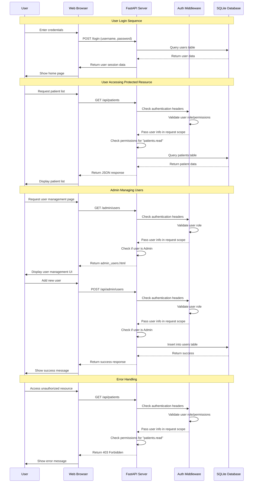

```mermaid
sequenceDiagram
    participant U as User
    participant W as Web Browser
    participant F as FastAPI Server
    participant M as Auth Middleware
    participant D as SQLite Database

    Note over U,D: User Login Sequence
    U->>W: Enter credentials
    W->>F: POST /login (username, password)
    F->>D: Query users table
    D-->>F: Return user data
    F->>W: Return user session data
    W->>U: Show home page

    Note over U,D: User Accessing Protected Resource
    U->>W: Request patient list
    W->>F: GET /api/patients
    F->>M: Check authentication headers
    M->>M: Validate user role/permissions
    M-->>F: Pass user info in request scope
    F->>F: Check permissions for "patients.read"
    F->>D: Query patients table
    D-->>F: Return patient data
    F-->>W: Return JSON response
    W->>U: Display patient list

    Note over U,D: Admin Managing Users
    U->>W: Request user management page
    W->>F: GET /admin/users
    F->>M: Check authentication headers
    M->>M: Validate user role
    M-->>F: Pass user info in request scope
    F->>F: Check if user is Admin
    F-->>W: Return admin_users.html
    W->>U: Display user management UI
    
    U->>W: Add new user
    W->>F: POST /api/admin/users
    F->>M: Check authentication headers
    M->>M: Validate user role
    M-->>F: Pass user info in request scope
    F->>F: Check if user is Admin
    F->>D: Insert into users table
    D-->>F: Return success
    F-->>W: Return success response
    W->>U: Show success message

    Note over U,D: Error Handling
    U->>W: Access unauthorized resource
    W->>F: GET /api/patients
    F->>M: Check authentication headers
    M->>M: Validate user role/permissions
    M-->>F: Pass user info in request scope
    F->>F: Check permissions for "patients.read"
    F-->>W: Return 403 Forbidden
    W->>U: Show error message
```